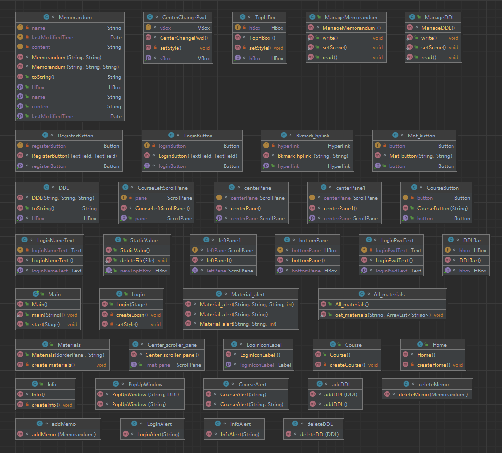

# 说明文档

## 小组信息

| 姓名           | 学号     | 负责内容                                                     |
| -------------- | -------- | ------------------------------------------------------------ |
| （组长）张一驰 | 20231097 | 账号管理部分，顶部信息栏（`Login.java`，`Home.java`，`Info.java` `StaticValue.java`） |
| 杨戈           | 20211102 | 学习资料部分，包含本地资料和书签链接（`Course.java`，`Materials.java`） |
| 张希辰         | 20373879 | DDL部分、备忘录部分（`ManageDDL.java`，`ManageMemorandum.java`） |

## 项目内容

本项目为学业管理助手（简称学业助理），主要帮助学生管理课程资料、DDL，同时具有备忘录等功能，便于对每学期的课程进行归纳总结，避免在寻找资料、查询DDL等方面重复浪费时间，提高学习效率。

本项目可分为四部分：账号管理，课程资料，DDL，备忘录

### 账号管理

用户首次使用时，需先进行注册操作，后续可通过该用户名、密码进行登录

用户登录后，可在主界面选择个人信息，在其中修改账号密码，可退出该账号，重新登录其他账号

### 课程资料

该部分按课程分类，对于每门课程，具有本地资料和书签链接两部分信息。

#### 本地资料

该部分为本地文件资料，通过右键新增或拖拽上传后，将会在资料部分生成该文件对应按钮，通过点击某一文件按钮，可打开该文件进行查看、编辑，可通过右键进行编辑、删除。

用户可在该部分添加课程PPT、板书图片、往年试题、个人笔记等文件。

#### 书签链接

该部分为链接，通过右键新增书签链接（包括书签名称、网址链接两部分）后，将会在书签链接部分生成对应超链接，点击即可访问该链接，进行后续操作，可通过右键进行编辑、删除。

用户可在该部分添加课程资料网站（如https://os.buaa.edu.cn/），作业提交网站（如https://scs.buaa.edu.cn/）等链接。

### DDL

该部分为DDL管理，及任务截止日期管理，通过点击按钮新增一条DDL（包括DDL内容、链接地址、截止日期）后，将会在DDL部分展示，并按截止日期升序排列，同时已过期的条目将被标记为红色，对用户提出警告。

用户可在该部分添加课程布置的作业等内容。

### 备忘录

该部分为备忘录，通过点击按钮新增一条备忘录（包括标题及内容）后，相应按钮将在左侧显示，点击对应按钮即可进行查看、编辑、删除等功能。

用户可在该部分添加一些提示性内容，如设计灵感、解题技巧等

## 目录结构

* 源代码在`./src`目录下为项目源代码
* `./data`目录下为用户数据
  * `./user/ddl.txt`存储user用户的DDL信息
  * `./user/Memorandum.txt`存储user用户的DDL信息
  * `./user/资源`目录下存储user用户的课程资料信息
    * `./user/资源/course`目录下存储user用户，course课程的本地资料
    * `./user/资源/书签链接/link.txt`目录下存储user用户，course课程下，名为link的书签链接

## 环境

* 操作系统：Windows 10 家庭中文版 19042.1586
* 硬件种类：
  * CPU：AMD Ryzen 5 4600H
  * 内存：16.0GB
  * GPU：NVIDIA GeForce GTX 1650
* 开发环境：
  * IntelliJ IDEA 2021.3.1 (Ultimate Edition)
  * JDK 1.8.0_321
  * javafx 8.0.321-b07

## 类设计

## 算法或技术

## 说明书