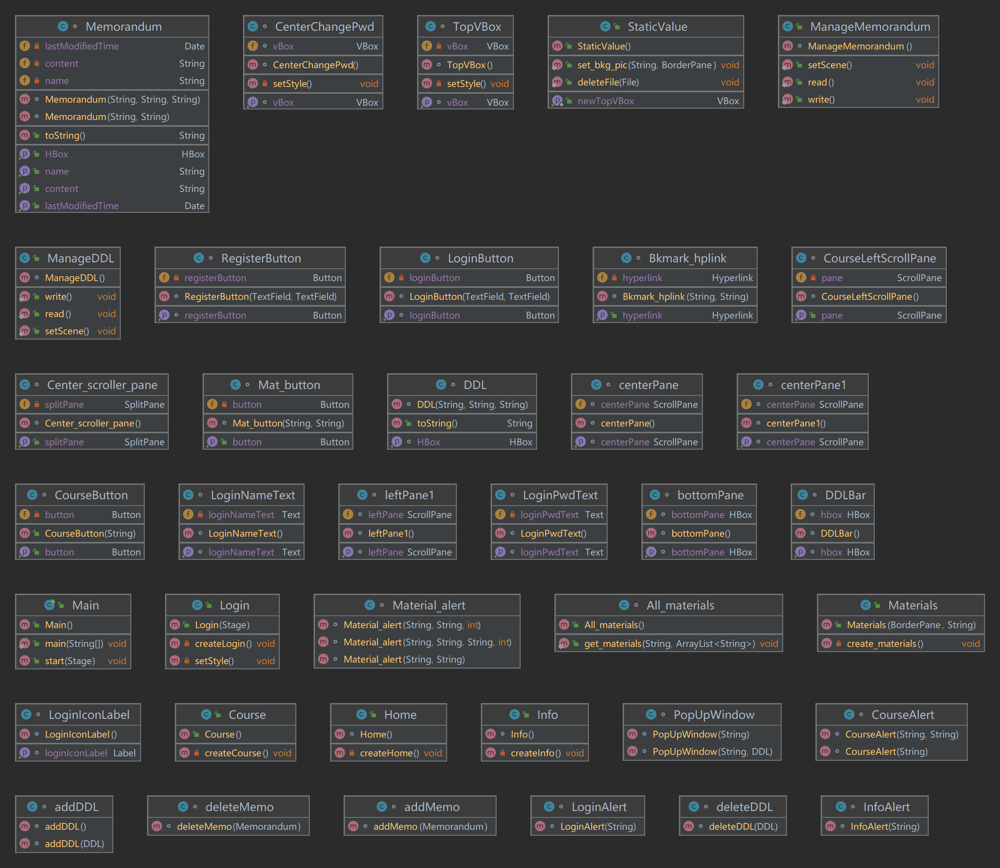
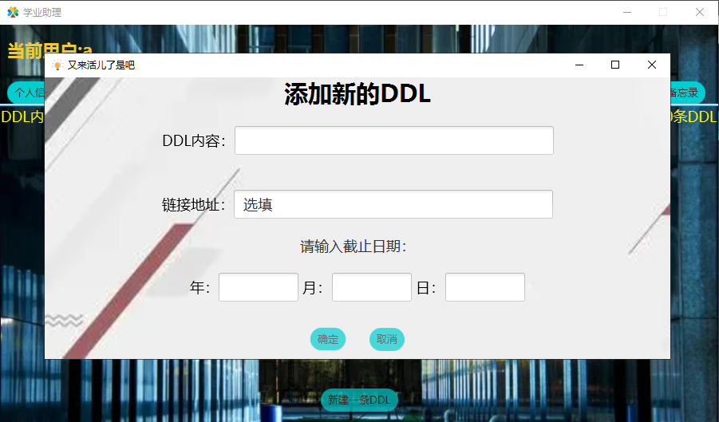

# 说明文档

## 小组信息

| 姓名      | 学号       | 负责内容                                     |
| ------- | -------- | ---------------------------------------- |
| （组长）张一驰 | 20231097 | 账号管理部分，顶部信息栏（`Login.java`，`Home.java`，`Info.java` `StaticValue.java`） |
| 杨戈      | 20211102 | 学习资料部分，包含本地资料和书签链接（`Course.java`，`Materials.java`） |
| 张希辰     | 20373879 | DDL部分、备忘录部分（`ManageDDL.java`，`ManageMemorandum.java`） |

## 项目信息

本项目为学业管理助手（简称学业助理），主要帮助学生管理课程资料、DDL，同时具有备忘录等功能，便于对每学期的课程进行归纳总结，避免在寻找资料、查询DDL等方面重复浪费时间，提高学习效率。

本项目可分为四部分：账号管理，课程资料，DDL，备忘录

主要代码为`java`，源代码2580行，总计（含注释及空行）3488行，此外还有少量`css`代码（16行）

### 账号管理

用户首次使用时，需先进行注册操作，后续可通过该用户名、密码进行登录

用户登录后，可在主界面选择个人信息，在其中修改账号密码，可退出该账号，重新登录其他账号

### 课程资料

该部分按课程分类，对于每门课程，具有本地资料和书签链接两部分信息。

#### 本地资料

该部分为本地文件资料，通过右键新增或拖拽上传后，将会在资料部分生成该文件对应按钮，通过点击某一文件按钮，可打开该文件进行查看、编辑，可通过右键进行编辑、删除。文件名称重复的不可添加，同时检查文件名是否正确。

用户可在该部分添加课程PPT、板书图片、往年试题、个人笔记等文件。

#### 书签链接

该部分为链接，通过右键新增书签链接（包括书签名称、网址链接两部分）后，将会在书签链接部分生成对应超链接，点击即可调用默认浏览器访问该链接，进行后续操作，可通过右键进行编辑、删除。会检查书签名和网址是否正确。

用户可在该部分添加课程资料网站（如https://os.buaa.edu.cn/），作业提交网站（如https://scs.buaa.edu.cn/）等链接。

### DDL

该部分为DDL管理，及任务截止日期管理，通过点击按钮新增一条DDL（包括DDL内容、链接地址、截止日期、距离截止日期剩余时间）后，将会在DDL部分展示，并按截止日期升序排列，同时已过期的条目将被标记为红色，对用户提出警告。用户也可以对已经存在的DDL信息进行修改。

用户可在该部分添加课程布置的作业等内容。

### 备忘录

该部分为备忘录，通过点击按钮新增一条备忘录（包括标题及内容）后，相应按钮将在左侧显示，点击对应按钮即可进行查看、编辑、删除等功能。

用户可在该部分添加一些提示性内容，如设计灵感、解题技巧等，也可存放一些常用的链接用于复制。

## 目录结构

* `./src`目录下为源代码、图片、css样式文件
  * `./src/img`为所需图片

* `./data`目录下为用户数据
  * `./user/ddl.txt`存储user用户的DDL信息
  * `./user/Memorandum.txt`存储user用户的DDL信息
  * `./user/资源`目录下存储user用户的课程资料信息
    * `./user/资源/course`目录下存储user用户，course课程的本地资料
    * `./user/资源/书签链接/link.txt`目录下存储user用户，course课程下，名为link的书签链接

## 环境

* 操作系统：Windows 10 家庭中文版 19042.1586
* 硬件种类：
  * CPU：AMD Ryzen 5 4600H
  * 内存：16.0GB
  * GPU：NVIDIA GeForce GTX 1650
* 开发环境：
  * IntelliJ IDEA 2021.3.1 (Ultimate Edition)
  * JDK 1.8.0_321
  * javafx 8.0.321-b07

## 类设计



## 算法或技术

### 布局

本项目采用`BorderPane`根布局，`BorderPane`将这个界面分为`center`，`top`，`right`，`bottom`，`left`五个部分。

在`BorderPane`的每个部分按照需求选择不同布局，包括但不限于：

* `VBox`：内部组件竖直排列

  


* `HBox`：内部组件水平排列

  


* `ScrollPane`：滚动窗格

  

- `SplitPane`：分割窗格

  

利用多种样式布局，结合自定义四周距离（`setMargin`），实现整个界面的布局

### 按钮动态样式

利用鼠标事件，当鼠标移动到按钮上时改变按钮样式，离开按钮上恢复原样式，实现按钮的动态样式

```java
button.setStyle(StaticValue.buttonStyle1);
button.setOnMouseMoved(e -> {
        button.setStyle(StaticValue.buttonStyle2);
});
button.setOnMouseExited(e -> {
	button.setStyle(StaticValue.buttonStyle1);
});
```

效果如下图所示

初始样式：


鼠标移动到“登录”按钮后：


初始样式：


鼠标移动到“Java”按钮后：


### 文件读写

本项目采用`FileReader`，`FileWriter`，操作**字符流**

### 文件拖动添加

完成如下两个函数控制拖动及拖动完成的动作：

`mat_scene.setOnDragDropped(new EventHandler<DragEvent>() {`

`mat_scene.setOnDragOver(new EventHandler<DragEvent>() {}`

### 文字、图案、背景设计

使用javafx自带函数以及css文件进行个性化设计

例如：

```java
pane.getStylesheets().add("bkg.css");
```

`bkg.css`:

```
.scroll-pane{
   -fx-background-color:transparent;
}
.scroll-pane .viewport {
   -fx-background-color: transparent;
}
```

### 超链接访问

按下链接后先读取对应文件中存储的链接，再使用默认浏览器打开

```java
EventHandler<ActionEvent> event =
                new EventHandler<ActionEvent>() {
                    public void handle(ActionEvent e)
                    {
                        String bkmark_path = ".//data//"+StaticValue.userName+"//资源//"+
                                Materials.course+"//书签链接//"+bkmark;
                        FileInputStream fis= null;
                        try {
                            fis = new FileInputStream(bkmark_path);
                        } catch (FileNotFoundException ex) {
                            ex.printStackTrace();
                        }
                        InputStreamReader isr= null;
                        try {
                            isr = new InputStreamReader(fis, "UTF-8");
                        } catch (UnsupportedEncodingException ex) {
                            ex.printStackTrace();
                        }
                        BufferedReader br = new BufferedReader(isr);
                        String bkmark_url = "";
                        try {
                            bkmark_url = br.readLine();
                            br.close();
                            isr.close();
                            fis.close();
                        } catch (IOException ex) {
                            ex.printStackTrace();
                        }

                        //创建一个url,使用默认浏览器打开
                        try {
                            URI url = new URI(bkmark_url);
                            java.awt.Desktop.getDesktop().browse(url);
                        } catch (IOException | URISyntaxException ex) {
                            ex.printStackTrace();
                        }
                    }

                };
```


### 背景图片动态展示

利用多线程技术，每隔三秒切换一张背景图片，共三张，编号0，1，2

创建另一个线程，该线程负责切换背景的`Style`（即背景图片路径），每次切换后背景图片编号加1模3，线程休眠3秒，以达到动态循环切换的效果，具体代码如下：

```java
new Thread(() -> {
            while (true){
                String image = "/img/login" + String.valueOf(WALLPAPER_NUM) + ".jpg";
                loginPane.setStyle("-fx-background-image: url("+ image +");" +
                        "-fx-background-size: cover");
                WALLPAPER_NUM = (WALLPAPER_NUM + 1) % 3;
                try {
                    Thread.sleep(3000);
                } catch (InterruptedException e) {
                    e.printStackTrace();
                }
            }
        }).start();
```

效果如下：


### 时间合法性判断

把字符串通过SimpleDateFormat解析后得到的data数据类型再转换为字符串，将该新字符串和原字符串对比，如果相同说明原字符串表示的日期合法。

```java
try{
	/*......*/
    SimpleDateFormat sdf = new SimpleDateFormat("yyyy-MM-dd");
    Date testDate=sdf.parse(theDate);
    String testString = sdf.format(testDate);

    if(testDate.compareTo(new Date())<=0){
          throw new Exception();
     }
     if(!testString.equals(theDate)){
           throw new Exception();
     }
   	 /*......*/
}
catch(Exception exception){
     new PopUpWindow("请输入正确的年月日信息,且日期不能早于当前",parentDDL);
     addDDLStage.close();
}
```

### 正则表达式分割原始数据

```java
String[] manyDDLs=row_data.split("###");
/*不同ddl的数据用'###'分割*/
for(int i=0;i<manyDDLs.length-1;i++){
	String[] oneDDL=manyDDLs[i].split(",,");
	DDL newDDL=new DDL(oneDDL[2],oneDDL[1],oneDDL[0]);
    ManageDDL.ddlArrayList.add(newDDL);
}
/*一条ddl中的不同数据部分用'，，'分割*/
```

### 排序

调用java.util库中的Collections.sort方法并重写其compare方法实现ddl和备忘录的按照时间排序。

```java
Collections.sort(ManageDDL.ddlArrayList, new Comparator<DDL>() {
    @Override
	public int compare(DDL o1, DDL o2) {
    if((o1.str).compareTo(o2.str)>0)
      return 1;
    else
      return -1;
     }
});
```


## 说明书

该部分旨在提供本项目使用教程，分为账号管理、课程资料、DDL、备忘录四部分介绍，附带图示。

### 账号管理

##### 注册

首次使用时，需要注册账号，初始界面如下：


输入用户名、密码，点击注册按钮即可注册，若未输入用户名、未输入密码、用户名已存在，将会进行相应提示。


##### 登录

输入用户名及密码，点击登录按钮即可登录，若存在未输入用户名、未输入密码、用户名已存在、密码错误，将会进行相应提示。

登陆成功后主界面如下，左上角显示当前用户名：


##### 退出

进入主界面，点击退出按钮，将会向用户确认是否退出：


点击确定即可退出，返回登陆界面

##### 修改密码

点击个人信息界面如下：


输入旧密码及两次新密码，点击修改密码，若存在旧密码错误、两次新密码不一致、新旧密码相同等问题，将会进行相应提示。

成功修改后，界面如下：


### 课程资料

主界面点击课程资料，即可切换至课程资料页面：


#### 课程

##### 添加

新用户无课程，在界面左侧右键即可添加课程


点击即弹出添加课程提示框：


输入要添加的课程名，若存在课程名为空、课程名重复等问题，将会进行相应提示。

添加成功后相应课程按钮将会在左侧显示：


##### 删除

在相应课程按钮上右键，将会出现删除选项：


点击删除，将会向用户确认是否删除：


点击确定将会删除该课程：


##### 编辑

在相应课程按钮上右键，将会出现编辑选项：


点击编辑，将会弹出编辑提示框：


输入新课程名称后点击确定即可更改该课程名称

#### 本地资料

##### 添加

点击某一课程按钮，将切换至该课程资料页面：


左侧为本地资料，右键将会出现添加资料选项：


点击添加资料，将会弹出添加资料提示框：


可选择输入资料名称或拖拽本地文件，前者将在该用户该课程下新建相应文件，后者将在该用户该课程下复制相应文件，并在左侧显示相应文件按钮，点击即可打开该文件：


##### 删除

在相应本地资料按钮上右键，将会出现删除选项：


后续操作类似课程删除，不再赘述

##### 编辑

在相应本地资料按钮上右键，将会出现编辑选项：


后续操作类似课程编辑，将会重命名该文件，不再赘述

#### 书签链接

##### 添加

右侧为书签链接，右键将会出现添加书签选项：


输入书签名称、网址链接，点击确定即可添加该书签，并在右侧显示，点击即可通过默认浏览器访问：


##### 删除

在相应书签链接按钮上右键，将会出现删除选项：


后续操作类似课程删除，不再赘述

##### 编辑

在相应本地资料按钮上右键，将会出现编辑选项：


### DDL

主界面点击课程资料，即可切换至DDL页面：


点击下方按钮将会弹出新建DDL提示框：



输入相应信息，点击确定即可添加，并在上方显示：


后续编辑和删除逻辑与前面部分类似，不再赘述

### 备忘录

主界面点击课程资料，即可切换至备忘录页面：


点击左侧按钮将会弹出新建备忘录提示框：


输入相应信息，点击确定即可添加，并在右侧显示：


后续编辑和删除逻辑与前面部分类似，不再赘述