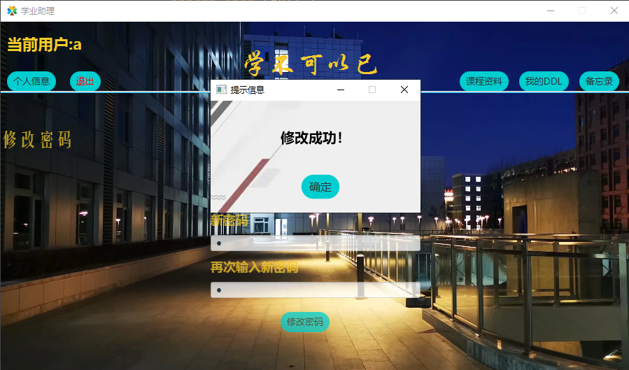

# 说明文档

## 小组信息

| 姓名           | 学号     | 负责内容                                                     |
| -------------- | -------- | ------------------------------------------------------------ |
| （组长）张一驰 | 20231097 | 账号管理部分，顶部信息栏（`Login.java`，`Home.java`，`Info.java` `StaticValue.java`） |
| 杨戈           | 20211102 | 学习资料部分，包含本地资料和书签链接（`Course.java`，`Materials.java`） |
| 张希辰         | 20373879 | DDL部分、备忘录部分（`ManageDDL.java`，`ManageMemorandum.java`） |

## 项目内容

本项目为学业管理助手（简称学业助理），主要帮助学生管理课程资料、DDL，同时具有备忘录等功能，便于对每学期的课程进行归纳总结，避免在寻找资料、查询DDL等方面重复浪费时间，提高学习效率。

本项目可分为四部分：账号管理，课程资料，DDL，备忘录

### 账号管理

用户首次使用时，需先进行注册操作，后续可通过该用户名、密码进行登录

用户登录后，可在主界面选择个人信息，在其中修改账号密码，可退出该账号，重新登录其他账号

### 课程资料

该部分按课程分类，对于每门课程，具有本地资料和书签链接两部分信息。

#### 本地资料

该部分为本地文件资料，通过右键新增或拖拽上传后，将会在资料部分生成该文件对应按钮，通过点击某一文件按钮，可打开该文件进行查看、编辑，可通过右键进行编辑、删除。

用户可在该部分添加课程PPT、板书图片、往年试题、个人笔记等文件。

#### 书签链接

该部分为链接，通过右键新增书签链接（包括书签名称、网址链接两部分）后，将会在书签链接部分生成对应超链接，点击即可访问该链接，进行后续操作，可通过右键进行编辑、删除。

用户可在该部分添加课程资料网站（如https://os.buaa.edu.cn/），作业提交网站（如https://scs.buaa.edu.cn/）等链接。

### DDL

该部分为DDL管理，及任务截止日期管理，通过点击按钮新增一条DDL（包括DDL内容、链接地址、截止日期）后，将会在DDL部分展示，并按截止日期升序排列，同时已过期的条目将被标记为红色，对用户提出警告。

用户可在该部分添加课程布置的作业等内容。

### 备忘录

该部分为备忘录，通过点击按钮新增一条备忘录（包括标题及内容）后，相应按钮将在左侧显示，点击对应按钮即可进行查看、编辑、删除等功能。

用户可在该部分添加一些提示性内容，如设计灵感、解题技巧等

## 目录结构

* 源代码在`./src`目录下为项目源代码
* `./data`目录下为用户数据
  * `./user/ddl.txt`存储user用户的DDL信息
  * `./user/Memorandum.txt`存储user用户的DDL信息
  * `./user/资源`目录下存储user用户的课程资料信息
    * `./user/资源/course`目录下存储user用户，course课程的本地资料
    * `./user/资源/书签链接/link.txt`目录下存储user用户，course课程下，名为link的书签链接

## 环境

* 操作系统：Windows 10 家庭中文版 19042.1586
* 硬件种类：
  * CPU：AMD Ryzen 5 4600H
  * 内存：16.0GB
  * GPU：NVIDIA GeForce GTX 1650
* 开发环境：
  * IntelliJ IDEA 2021.3.1 (Ultimate Edition)
  * JDK 1.8.0_321
  * javafx 8.0.321-b07

## 类设计


## 算法或技术

### 布局

本项目采用`BorderPane`根布局，`BorderPane`将这个界面分为`center`，`top`，`right`，`bottom`，`left`五个部分。

在`BorderPane`的每个部分按照需求选择不同布局，包括但不限于：

* `VBox`：内部组件竖直排列

  

  

* `HBox`：内部组件水平排列

  

  

* `ScrollPane`：滚动窗格

  

利用多种样式布局，结合自定义四周距离（`setMargin`），实现整个界面的布局

### 按钮动态样式

利用鼠标事件，当鼠标移动到按钮上时改变按钮样式，离开按钮上恢复原样式，实现按钮的动态样式

```java
button.setStyle(StaticValue.buttonStyle1);
button.setOnMouseMoved(e -> {
        button.setStyle(StaticValue.buttonStyle2);
});
button.setOnMouseExited(e -> {
	button.setStyle(StaticValue.buttonStyle1);
});
```

效果如下图所示

初始样式：


鼠标移动到“登录”按钮后：


初始样式：


鼠标移动到“Java”按钮后：


### 文件读写

本项目采用`FileReader`，`FileWriter`，操作**字符流**

### 背景图片动态展示

利用多线程技术，每隔三秒切换一张背景图片，共三张，编号0，1，2

创建另一个线程，该线程负责切换背景的`Style`（即背景图片路径），每次切换后背景图片编号加1模3，线程休眠3秒，以达到动态循环切换的效果，具体代码如下：

```java
new Thread(() -> {
            while (true){
                String image = "/img/login" + String.valueOf(WALLPAPER_NUM) + ".jpg";
                loginPane.setStyle("-fx-background-image: url("+ image +");" +
                        "-fx-background-size: cover");
                WALLPAPER_NUM = (WALLPAPER_NUM + 1) % 3;
                try {
                    Thread.sleep(3000);
                } catch (InterruptedException e) {
                    e.printStackTrace();
                }
            }
        }).start();
```

效果如下：


## 说明书